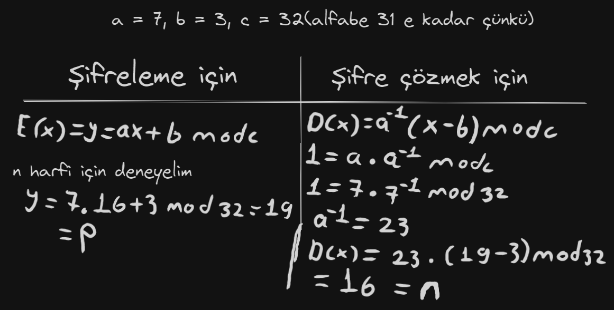

# Affine Şifreleme

 Metni matematiksel işlemler yardımıyla şifreli metne dönüştürür. Bu yöntemde, her harf bir sayı değeri ile eşleştirilir ve ardından belirli matematiksel formüller kullanılarak şifreleme yapılır.

## Tablo 

Her harfe sayı gelcek şekilde bir örnek bkz:

|   |   |   |   |   |   |   |   |   |   |   |   |   |   |   |   |   |
|---|---|---|---|---|---|---|---|---|---|---|---|---|---|---|---|---|
| a | b | c | ç | d | e | f | g | ğ | h | ı | i | j | k | l | m | n |
| 0 | 1 | 2 | 3 | 4 | 5 | 6 | 7 | 8 | 9 | 10 | 11 | 12 | 13 | 14 | 15 | 16 |
| o | ö | p | q | r | s | ş | t | u | ü | v | w | x | y | z |  |   |
| 17  | 18  | 19  | 20  | 21  | 22  | 23 | 24  | 25  | 26  | 27  | 28  | 29  | 30  | 31

## Şifreleme Adımları

Adımlar şöyledir:

1. Girdideki her harf, tablodaki sayı değeri ile eşitlenir(a ise 0 gibi).
2. Şifreleme anahtarları olan `a` ve `b` belirlenir.
3. Metindeki her harfin sayı değeri, `(a * x + b) mod c` formülü ile şifrelenir. Burada `x` harfin sayı değeri, `a` ve `b` şifreleme anahtarları, `c` ise mod değeridir.
4.  Sonuç olarak  elde edilen şifreli sayı değerleri tablodaki karşılığı neyse o yazılı(12 çıktı mesela j yazılır).

## Matematiksel olarak örn

## Notlar

- Anahtarlar `a` ve `b` uygun olmalıdır yoksa düzgün çalışmayabilir.
- Mod değeri `c` alfabenin son index sayısına göre yapılmalı(bizdeki 31 mesela mod 32 almalıyız).
- C# örneği var yine aynı dizide bakabilirsiniz saygılar sevgiler.